# ClickMesa App 🍽️🚀

### Branches
- `dev`: Integração contínua
- `feature/backend`: Desenvolvimento da API
- `feature/frontend`: Interface do usuário

### Resumo do Projeto

Muitas pessoas enfrentam dificuldades para organizar refeições e listas de compras de forma eficiente, gerando desperdício de tempo e recursos. Esse problema é relevante porque a falta de planejamento alimentar pode levar a compras desnecessárias, gastos excessivos e dificuldade em manter uma rotina saudável. Para resolver essa questão, o ClickMesa App surge como uma plataforma web que auxilia no agendamento de refeições, decomposição de receitas, geração automática de listas de compras e localização de supermercados próximos. Com isso, a ferramenta otimiza o planejamento alimentar, reduzindo tempo e custos, além de facilitar a organização doméstica.

### Definição do Problema

Organizar refeições saudáveis e variadas tem se tornado um desafio crescente na vida moderna. Com rotinas cada vez mais aceleradas, profissionais, pais e estudantes enfrentam dificuldades para conciliar trabalho, estudos e vida pessoal com um planejamento alimentar eficiente. O resultado são escolhas pouco saudáveis, como refeições repetitivas ou excesso de delivery, além de desperdício de alimentos e gastos acima do necessário.

Um exemplo claro desse problema é o caso de Ana, uma profissional que trabalha em tempo integral e cuida de sua família. Ela deseja preparar refeições nutritivas e saborosas, mas se vê constantemente sobrecarregada pela falta de tempo e organização. Sem um planejamento adequado, Ana acaba repetindo pratos ou recorrendo a delivery, o que afeta sua saúde e seu orçamento. Além disso, ela frequentemente compra ingredientes em excesso, que acabam estragando antes de serem usados, e enfrenta dificuldades para encontrar os itens necessários nos supermercados próximos, perdendo tempo em deslocamentos desnecessários.

Esses desafios não são exclusivos de Ana. Muitas pessoas compartilham das mesmas frustrações, evidenciando a necessidade de uma solução que simplifique o processo de planejamento alimentar. Uma plataforma integrada, capaz de sugerir cardápios personalizados, gerar listas de compras automáticas e indicar onde encontrar os ingredientes necessários, poderia transformar a maneira como as pessoas lidam com a alimentação no dia a dia.

Além da praticidade, essa solução traria benefícios econômicos e ambientais, reduzindo o desperdício de alimentos e ajudando os usuários a economizarem tempo e dinheiro. Ao promover uma alimentação mais equilibrada e organizada, a plataforma não apenas resolveria problemas imediatos, mas também contribuiria para um estilo de vida mais saudável e sustentável.

A empresa de pesquisa de opinião Opinion Box em parceria com a empresa de inteligência de dados Neogrid realizou uma pesquisa com consumidores do varejo brasileiro "Tendências de Bens de Consumo para 2024" e alguns dados corroboram com as impressões deste trabalho. Em torno de 60% dos 2.212 entrevistados pela pesquisa, em todo o território nacional, acreditam que tanto preço quanto promoções e desconto são fatores importantes na escolha de produtos enquanto que questões de marca do produto só está representada em 17% na escolha de produto por parte dos consumidores.

Ainda sobre a pesquisa realizada, e que traz impacto para as decisões de escolha das features neste projeto é que em 64% das entrevistas os consumidores buscam comparar preços de supermercados de grande porte com os pequenos mercados de bairro. Reconhecer e localizar os pontos de venda perto de casa ou da localidade que o consumidor se encontra pode se mostrar uma ferramenta muito útil com reflexos não só no tempo despendido para essa atividade como principalmente no orçamento do consumidor. 

Importante destacar que 86% do público entrevistado ainda realiza predominantemente suas compras de supermercado de forma presencial, logo utilizar uma aplicação de rápido acesso que produza uma lista de compras eficiente ainda é uma ferramenta muito útil para o dia a dia dos consumidores.

A organização eficiente de compras e refeições é um desafio para grande parte do público, conforme revelado por uma pesquisa realizada com potenciais usuários da ClickMesa App . Apesar de 90% dos entrevistados já adotarem algum tipo de planejamento prévio de compras, 70% ainda recorrem a métodos pouco práticos, como anotações manuais no celular — um processo suscetível a falhas e que demanda esforço constante do usuário. Essa dependência de soluções improvisadas evidencia uma lacuna no mercado: a falta de ferramentas que integrem automação e personalização às necessidades cotidianas.

Entre as funcionalidades analisadas, a decomposição automática de receitas destacou-se como a mais demandada, com 87% de interesse, enquanto o agendamento de refeições teve relevância menor (18%). Já a geração automática de listas de compras e a integração com geolocalização de mercados foram citadas como prioritárias por 30% do público — percentual que, embora aparentemente baixo, representa um nicho significativo quando associado a outros comportamentos. Por exemplo, 80% dos usuários demonstraram abertura a considerar um modelo de assinatura paga, desde que a plataforma ofereça benefícios claros e customização, dois aspectos frequentemente negligenciados por alternativas existentes.

Esses resultados reforçam que, embora haja soluções similares no mercado, a maioria falha em entregar uma experiência verdadeiramente adaptável ao usuário, combinando praticidade (como a automação de listas) e utilidade contextual (como a localização de mercados próximos). O ClickMesa App propõe-se a resolver essa deficiência não apenas otimizando tarefas isoladas, mas criando um ecossistema que conecta planejamento, execução e compras de forma intuitiva e personalizável.

Em um cenário onde a tecnologia está cada vez mais presente no cotidiano, desenvolver uma ferramenta que facilite o planejamento de refeições é mais do que uma conveniência é uma forma de melhorar a qualidade de vida das pessoas, tornando a alimentação saudável acessível e sem complicações.

### Objetivos

O projeto ClickMesa App tem como objetivo desenvolver uma plataforma inteligente que automatiza o planejamento alimentar, transformando receitas culinárias em listas de compras personalizadas e georreferenciadas. Ao integrar decomposição automática de ingredientes com a localização de supermercados próximos (via APIs como Google Maps), a solução busca otimizar tempo e recursos do usuário, unindo organização doméstica, economia e conveniência em um único ecossistema digital.

O projeto ClickMesa App visa transformar o planejamento alimentar através de uma plataforma integrada que combina três pilares fundamentais: (1) simplificação da organização de refeições com agendamento intuitivo de cardápios e ajustes dinâmicos; (2) automação inteligente de listas de compras que categoriza ingredientes a partir das receitas agendadas, eliminando esquecimentos e reduzindo desperdícios; e (3) integração inovadora entre cozinha e mercado, conectando listas de compras a supermercados locais com funcionalidades de geolocalização, rotas e verificação de disponibilidade em tempo real. Esta tríade de soluções posiciona o ClickMesa App como ferramenta essencial para transformar a rotina alimentar em um processo eficiente, econômico e adaptável às necessidades contemporâneas.

### Stack Tecnológico

O projeto ClickMesa App foi desenvolvido com uma stack tecnológica moderna e robusta, escolhida criteriosamente para atender às demandas específicas da plataforma. Para o backend, optou-se pelo FastAPI (framework web Python) devido à sua performance excepcional, tipagem estática integrada e geração automática de documentação OpenAPI, que agilizam o desenvolvimento de APIs RESTful seguras e escaláveis. Essa escolha é complementada pelo PostgreSQL, um banco de dados relacional que oferece confiabilidade, suporte a consultas complexas e extensibilidade – características essenciais para gerenciar dados estruturados de usuários, receitas e supermercados com integridade.

A integração do Swagger/OpenAPI no desenvolvimento da API do ClickMesa App — gerada automaticamente pelo FastAPI — oferece documentação interativa em tempo real, permitindo visualizar endpoints, parâmetros e exemplos de chamadas diretamente na interface. Isso agiliza testes práticos (sem ferramentas externas), sincroniza a equipe com atualizações instantâneas do código e padroniza a integração com frontend ou futuros serviços, reduzindo erros e custos de manutenção. Além disso, a especificação OpenAPI garante compatibilidade para expansões, como geração de SDKs ou adaptação a novos clientes (ex.: apps móveis), consolidando a API como um produto escalável e bem documentado.

No frontend, a combinação de Next.js e React proporciona uma experiência dinâmica e responsiva, aproveitando a renderização híbrida (SSR e CSR) para melhor desempenho e SEO. O Material-UI foi incorporado como biblioteca de componentes para garantir uma interface coesa, acessível e alinhada com as melhores práticas de design, reduzindo o tempo de desenvolvimento sem sacrificar a customização.

A integração com a API do Google Maps será utilizada para fornecer a localização de supermercados próximos ao usuário, enriquecendo a experiência com dados georreferenciados em tempo real. Essa escolha se justifica pela confiabilidade, ampla cobertura e recursos avançados de geolocalização oferecidos pela plataforma do Google, além de sua fácil integração com o ecossistema já adotado (FastAPI no backend e React no frontend). A inclusão dessa API externa reforça a capacidade do sistema em entregar um serviço completo e alinhado com as expectativas do usuário, garantindo precisão e praticidade na funcionalidade de localização.

No contexto de desenvolvimento e para garantir a máxima performance e estabilidade durante as demonstrações, toda a aplicação ClickMesa App, incluindo o frontend, backend e o banco de dados PostgreSQL, é configurada para operar em um ambiente local. Esta abordagem minimiza dependências de rede e latências, assegurando uma experiência de usuário fluida e responsiva, essencial para a validação do projeto.

### Descrição da Solução 

O ClickMesa App é uma aplicação web desenvolvida para simplificar e otimizar o planejamento alimentar, resolvendo os problemas de desorganização e desperdício identificados na pesquisa. A plataforma funciona como um assistente inteligente, combinando um banco de dados de receitas detalhadas com funcionalidades integradas de geolocalização e automação. Cada receita cadastrada é decomposta em seus ingredientes, que são então convertidos em listas de compras inteligentes, personalizadas de acordo com as necessidades do usuário. Além disso, a integração com APIs de mapas permite a localização de supermercados próximos, fechando o ciclo entre planejamento e execução das compras.

O ClickMesa App oferece um sistema de agendamento que permite aos usuários planejar suas refeições diárias ou semanais com poucos cliques. A interface intuitiva possibilita a seleção de receitas pré-cadastradas ou personalizadas, organizando-as em um calendário visual. Essa funcionalidade não apenas economiza tempo, mas também ajuda a manter uma dieta balanceada, já que os usuários podem distribuir os pratos de forma estratégica, evitando repetições ou desequilíbrios nutricionais.

Ao selecionar uma receita, a plataforma realiza automaticamente a decomposição de ingredientes, listando todos os itens necessários para o preparo. Essa funcionalidade é especialmente útil para evitar esquecimentos e compras desnecessárias, já que os usuários têm clareza sobre o que precisam adquirir. Além disso, a decomposição pode ser ajustada de acordo com o número de porções, garantindo precisão nas quantidades e reduzindo desperdícios.

Com base nas receitas agendadas, o ClickMesa App gera listas de compras automáticas, agrupando ingredientes por categorias (ex.: hortifrúti, laticínios, mercearia). Essa organização facilita a navegação no supermercado e reduz o tempo gasto nas compras. A lista também pode ser editada manualmente, permitindo a inclusão de itens adicionais ou a remoção daqueles que o usuário já possui em casa.

Integrada a APIs de geolocalização (como Google Maps), a plataforma identifica os supermercados mais próximos do usuário, exibindo rotas e tempos de deslocamento. Opcionalmente, pode incluir informações sobre promoções ou disponibilidade de produtos, tornando a experiência de compra ainda mais eficiente. Essa funcionalidade não apenas poupa tempo, mas também ajuda a reduzir custos, já que os usuários podem comparar opções e escolher o estabelecimento mais conveniente.

##### Tela Inicial da Aplicação
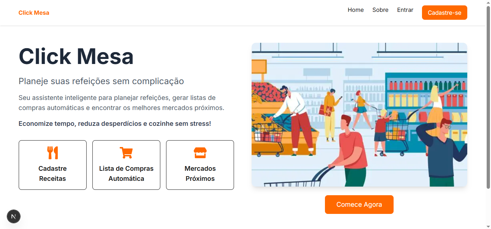

##### Página Sobre Nós
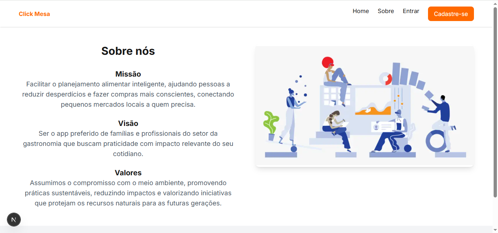

##### Página de Cadastro
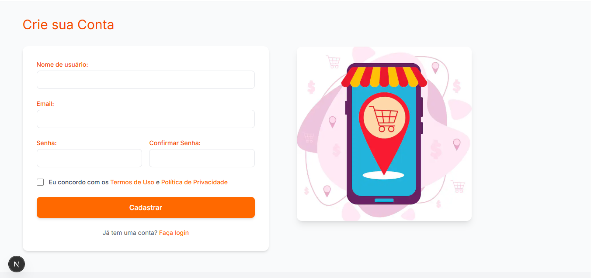

#### Página do Dashboard
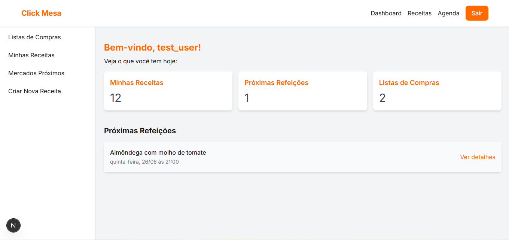

#### Página da Agenda 
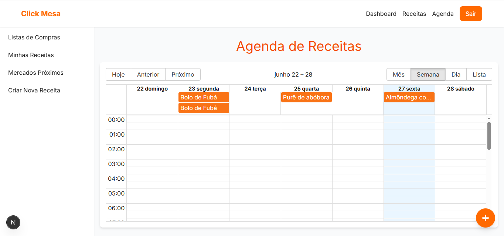

#### Página da Lista de Datas Compiladas
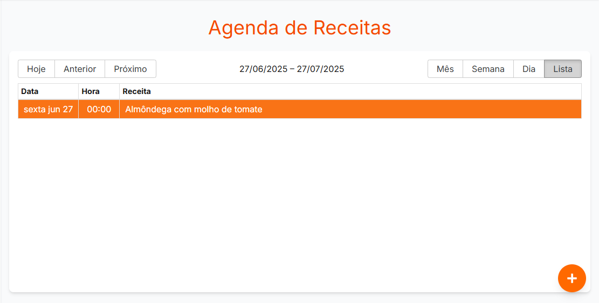

#### Página Formulário de Receitas
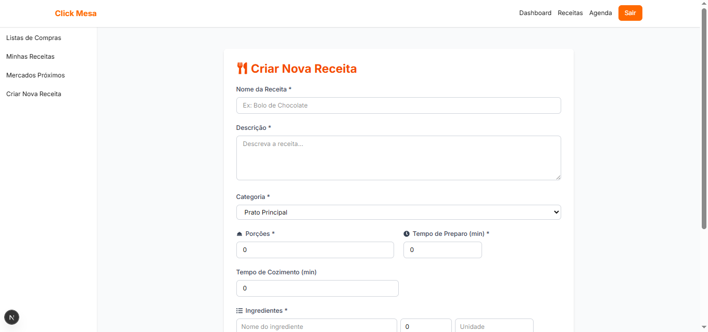

#### Página Receitas por Usuário
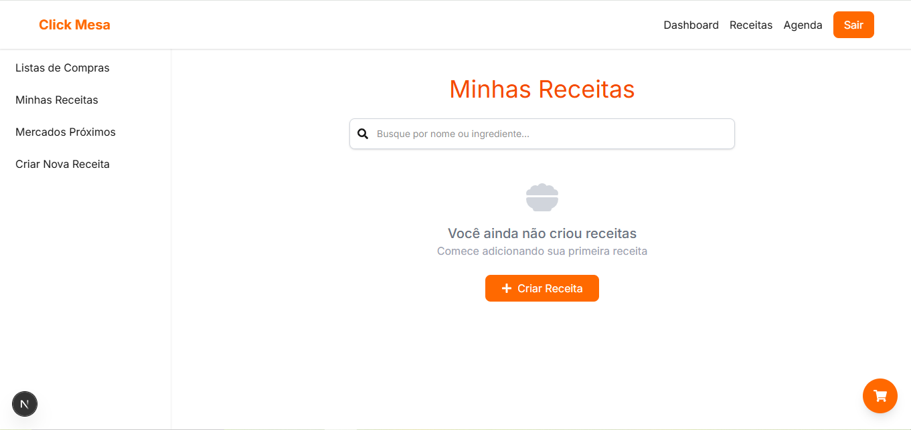

#### Página Lista
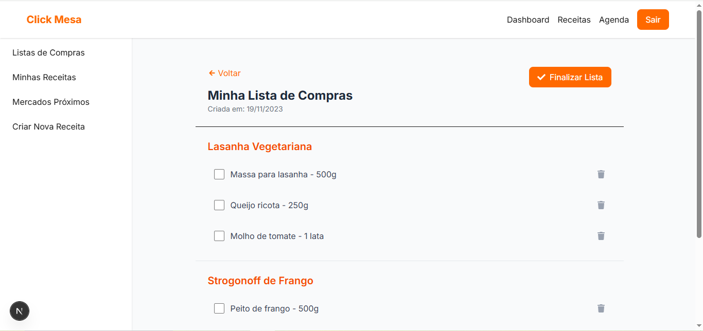

#### Mapa dos supermercados próximos
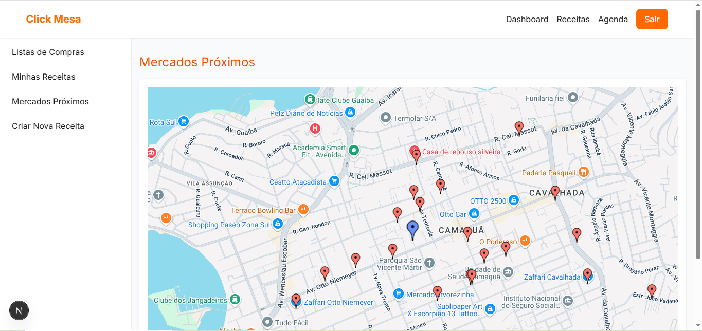

### Arquitetura

##### Diagrama Entidade e Relacionamento

O Diagrama Entidade-Relacionamento (DER) apresentado ilustra a estrutura lógica do banco de dados do ClickMesa App, definindo as entidades principais da aplicação, seus atributos e como elas se relacionam entre si. Este modelo é a base para a persistência dos dados e reflete as funcionalidades de planejamento de refeições, gestão de receitas, criação de listas de compras e localização de supermercados.

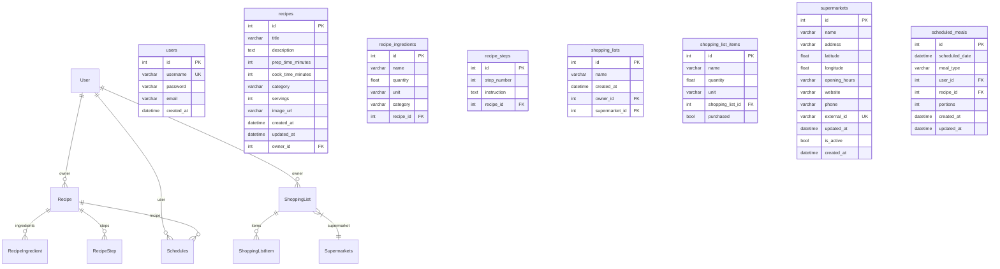

O design do banco de dados, conforme ilustrado no Diagrama Entidade-Relacionamento (DER), é a espinha dorsal que habilita um conjunto abrangente de funcionalidades no ClickMesa App. Primeiramente, ele permite a Gestão de Usuários, abrangendo o cadastro e a identificação única de cada indivíduo dentro da plataforma.

Em seguida, o DER suporta plenamente o Planejamento de Refeições, possibilitando que os usuários agendem suas refeições por data e tipo, associando-as diretamente a receitas específicas disponíveis no sistema. Conectado a isso, há a Gestão de Receitas, onde todas as receitas podem ser armazenadas, organizadas por nome e categoria, garantindo que o ClickMesa App ofereça uma vasta biblioteca culinária. A Composição de Receitas é detalhada por meio do relacionamento entre receitas e ingredientes.

Além do planejamento de refeições, o banco de dados é fundamental para a Criação e Gestão de Listas de Compras. Usuários podem gerar e administrar suas próprias listas, que são diretamente associadas às suas contas. Complementarmente, a funcionalidade de Itens da Lista de Compras permite a adição de ingredientes específicos, com suas respectivas quantidades e unidades de medida, a qualquer lista, oferecendo flexibilidade para necessidades diversas.

Finalmente, e como um diferencial importante do ClickMesa App, o DER inclui a estrutura para a Localização de Supermercados. Isso se manifesta no armazenamento de dados detalhados sobre os supermercados, incluindo seus nomes, endereços e, crucialmente, suas coordenadas geográficas (latitude e longitude). Essa capacidade de armazenar e relacionar informações geográficas é o que viabiliza a funcionalidade de "Localização de Supermercados" destacada no benchmarking, permitindo que o aplicativo ajude os usuários a encontrar pontos de venda para suas compras.

##### Benchmarking

Para posicionar o ClickMesa App no mercado e identificar seus diferenciais competitivos, foi realizado um benchmarking detalhado, comparando os requisitos funcionais da nossa aplicação com os recursos oferecidos por aplicativos similares disponíveis no mercado. Esta análise permitiu validar a proposta de valor do ClickMesa App e destacar suas funcionalidades únicas.

A tabela abaixo resume a comparação atualizada entre o ClickMesa App e quatro aplicativos concorrentes: "Gostoso Receitas", "SuperCook Gerador de Receitas", "Samsung Food: Meal Planning" e "Cardápio Semanal - Menu Planner". Cada linha representa um requisito ou funcionalidade, e as colunas indicam se o respectivo aplicativo atende (✅) ou não atende (❌) a esse requisito.

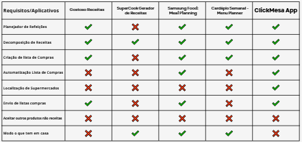

Um dos maiores e mais impactantes diferenciais do Click Mesa App nesta versão é a funcionalidade de Localização de Supermercados (✅). Notavelmente, nenhum dos concorrentes analisados ("Gostoso Receitas", "SuperCook", "Samsung Food" e "Cardápio Semanal") oferece esse recurso.

Esta funcionalidade coloca o ClickMesa App em uma posição de destaque no mercado, adicionando um valor prático significativo ao usuário. Ao integrar a localização de supermercados, o Click Mesa transcende o planejamento, auxiliando diretamente na etapa de aquisição dos itens, facilitando a vida do usuário e otimizando sua jornada de compras.

As funcionalidades de "Aceitar outros produtos não oriundos de receitas" e "Modo o que tem em casa", embora não presentes na versão atual, representam um roadmap claro para o desenvolvimento futuro. A equipe do ClickMesa App reconhece o valor dessas adições e as prioriza para próximas atualizações, visando expandir ainda mais o valor e a abrangência da aplicação para seus usuários.

### Validação

ada a limitação de tempo inerente ao ciclo de desenvolvimento deste projeto, a validação do ClickMesa App será prioritariamente focada na demonstração prática de suas funcionalidades chave durante a apresentação do trabalho. Esta abordagem pragmática visa validar a eficácia da solução por meio da sua operação real, permitindo que a audiência observe diretamente o funcionamento da aplicação e a concretização dos requisitos propostos.

Neste contexto, a validação será realizada da seguinte forma:

* **Apresentação Interativa e Fluxos de Uso:** Durante a apresentação, serão percorridos os principais fluxos de uso da aplicação, simulando cenários reais de interação do usuário. Isso incluirá:

* **Criação e Gestão de Contas de Usuário:** Demonstração do processo de cadastro e acesso à plataforma.

* **Planejamento de Refeições:** Exibição da interface para agendamento de refeições e associação a receitas.

* **Criação de Listas de Compras:** Apresentação da geração de listas, a partir de receitas. 

* **Diferencial de Localização de Supermercados:** Uma ênfase especial será dada à demonstração desta funcionalidade única, mostrando como o ClickMesa App integra dados de supermercados com suas localizações para auxiliar o usuário na etapa de compras.

Os testes serão executados em tempo real, evidenciando a responsividade e a integridade das operações. Embora não seja um teste de carga ou de performance exaustivo, a execução direta das funcionalidades servirá como uma prova de conceito robusta da arquitetura e implementação. A intenção é mostrar que a aplicação responde como esperado, que os dados são persistidos corretamente e que as interações entre as diferentes partes do sistema ocorrem sem falhas visíveis.

A validação se concentrará em provar que o conceito do ClickMesa App é funcional e que as tecnologias e o design de arquitetura escolhidos foram eficazes para entregar os requisitos principais. Aspectos como usabilidade e experiência do usuário serão avaliados de forma qualitativa através da interação e feedback direto dos avaliadores.

Esta estratégia de validação, embora compacta, é essencial para demonstrar a viabilidade técnica e o valor prático do ClickMesa App dentro do prazo estabelecido. Ela oferece uma visão clara e tangível do produto final, consolidando a compreensão do projeto e seu potencial.

### Estratégia

A estratégia para alcançar a validação prática mencionada será pautada na simulação de um cenário de uso real. Durante a apresentação, a equipe executará a aplicação como se fosse um usuário típico do ClickMesa App, percorrendo o fluxo completo de interação desde o cadastro até a utilização das funcionalidades mais complexas.

Esta simulação incluirá entre algumas atividades típicas da aplicação o registro e login demonstrando do processo de criação de uma nova conta e acesso ao sistema; a criação de receitas/planejamento de refeições com a inserção de dados para planejar uma refeição, mostrando a interface intuitiva para associar receitas a agendamentos.

A geração e edição de listas de compras será dada através da simulação da criação de uma lista de compras a partir de um plano de refeições e a posterior edição, adicionando ou removendo itens manualmente. A interação com a Localização de supermercados se dará por meio da utilização da funcionalidade de localização de supermercados, mostrando como o aplicativo exibe informações relevantes e auxilia o usuário a encontrar pontos de compra.

Ao simular um usuário real, buscamos não apenas mostrar que as funcionalidades técnicas operam como esperado, mas também que a experiência de uso é fluida e intuitiva, validando a usabilidade e a aderência da aplicação às necessidades de seus potenciais usuários. Esta abordagem permite que a audiência visualize o valor do ClickMesa App em um contexto prático e imediato.

## Conclusão

Ao longo do desenvolvimento do ClickMesa App, o principal desafio identificado foi a necessidade de otimizar o processo de planejamento de refeições e gestão de listas de compras para usuários domésticos, que frequentemente enfrentam dificuldades em organizar suas compras de supermercado e aproveitar ao máximo os ingredientes disponíveis. Com base nesse problema, o projeto estabeleceu como objetivos centrais fornecer uma plataforma intuitiva para o agendamento de refeições, a criação de receitas, a automatização de listas de compras e, principalmente, a localização de supermercados próximos, visando simplificar a vida dos usuários e promover uma alimentação mais organizada e econômica.

Os resultados obtidos com a implementação do ClickMesa App demonstram a efetividade da solução em atender a esses objetivos. Através de uma arquitetura moderna e robusta, baseada em FastAPI, PostgreSQL, Next.js e React, a aplicação oferece uma experiência fluida e responsiva, validada por meio de demonstrações práticas e simulações de uso real em ambiente local. Essa validação em tempo de execução confirmou que as funcionalidades chave, como o planejamento de refeições, a gestão de receitas e a geração de listas de compras, operam conforme o esperado, proporcionando uma ferramenta eficaz para o dia a dia dos usuários.

Um dos pontos de maior satisfação e um diferencial competitivo notável do ClickMesa App é a funcionalidade de localização de supermercados. Conforme evidenciado no benchmarking realizado, essa característica se destaca por sua ausência em aplicativos concorrentes, posicionando o ClickMesa App como uma solução inovadora que não apenas auxilia no planejamento, mas também na execução prática das compras, agregando um valor substancial à experiência do usuário. A automatização da lista de compras também se mostrou um ponto forte, simplificando significativamente o processo para o usuário.

Embora o escopo atual do projeto tenha limitações inerentes ao tempo de desenvolvimento, como o "Modo o que tem em casa" e a capacidade de "Aceitar outros produtos que não sejam de receitas" diretamente vinculados ao planejamento, o ClickMesa App já estabelece uma base sólida e funcional. Essas e outras funcionalidades, como a busca integrada por preço dos ingredientes, a expansão para plataformas móveis, um sistema de recompensas para engajamento e sugestões de receitas baseadas em preferências, são perspectivas futuras que consolidam um roadmap de desenvolvimento claro e promissor.

Em suma, o ClickMesa App representa uma solução implementada com sucesso, que não apenas endereça o problema inicial de organização alimentar, mas também se diferencia no mercado por suas inovações e seu potencial de crescimento. A satisfação com os resultados obtidos reside na entrega de uma aplicação funcional, com uma arquitetura bem definida e um claro caminho para futuras evoluções, prometendo simplificar e enriquecer a jornada culinária e de compras de seus usuários.

## Limitações do Projeto e Perspectivas Futuras

Embora o ClickMesa App apresente uma arquitetura robusta e um conjunto significativo de funcionalidades implementadas em sua versão atual, é fundamental reconhecer as limitações inerentes ao escopo inicial do projeto, que foram ditadas principalmente por prazos e recursos. No entanto, essas limitações abrem caminho para um vasto leque de perspectivas futuras e oportunidades de aprimoramento.

#### Limitações Atuais do Projeto

Na versão presente, o ClickMesa App possui as seguintes limitações que já foram identificadas e servem como pontos de partida para o roadmap de desenvolvimento: o modo "O que tem em casa", a aplicação não incorpora uma funcionalidade de gerenciamento de estoque doméstico ou de sugestão de receitas baseadas nos ingredientes que o usuário já possui. Aceitar outros produtos que não sejam de receitas: As listas de compras, em sua maioria, são geradas a partir de receitas. A capacidade de adicionar produtos avulsos ou não diretamente vinculados a receitas específicas ainda não está totalmente desenvolvida, limitando a abrangência da lista de compras para itens do dia a dia.

Essas duas funcionalidades ainda não desenvolvidas são ferramentas valiosas para evitar o desperdício de alimentos e otimizar o uso dos recursos existentes. Essas limitações, conforme apontado no benchmarking, representam áreas onde o ClickMesa App pode evoluir para oferecer uma experiência ainda mais completa e diferenciada.

#### Perspectivas futuras e melhorias planejadas

O roadmap de desenvolvimento do ClickMesa App inclui diversas funcionalidades estratégicas que visam expandir seu valor, aprimorar a experiência do usuário e garantir sua competitividade no mercado. As principais perspectivas futuras incluem:

* Busca Integrada por Preço dos Ingredientes: Uma funcionalidade ambiciosa é a integração com APIs de supermercados ou serviços de comparação de preços para permitir que os usuários pesquisem e comparem os preços dos ingredientes de suas listas de compras em diferentes estabelecimentos. Isso agregaria um valor econômico significativo, ajudando os usuários a economizar.

* Expansão para Plataformas Móveis: Atualmente focado em ambiente web, a expansão para aplicativos nativos em plataformas iOS e Android é uma prioridade. Isso garantirá maior acessibilidade, performance otimizada para dispositivos móveis e a possibilidade de utilizar recursos específicos do smartphone, como notificações push e scanners de código de barras.

* Sistema de Recompensas para Engajamento (Gamificação): Para incentivar o uso contínuo e o engajamento dos usuários, planeja-se implementar elementos de gamificação. Isso pode incluir pontos, distintivos ou níveis por completar planos de refeições, criar listas, ou adicionar novas receitas, promovendo uma experiência mais interativa e divertida.

* Sugestões de Receitas com Base nas Preferências dos Usuários: O desenvolvimento de um sistema de recomendação inteligente que utilize algoritmos para analisar as preferências de receitas e histórico de uso do usuário. Isso permitiria ao ClickMesa App oferecer sugestões personalizadas e relevantes, enriquecendo a descoberta culinária.

Essas perspectivas futuras demonstram o potencial de crescimento do ClickMesa App, com um compromisso contínuo em entregar uma solução cada vez mais completa, inteligente e alinhada às necessidades de seus usuários.

## Referências Bibliográficas

FastAPI Documentation. https://fastapi.tiangolo.com .  Acesso em: 27/06/2025.

FastAPI do Zero. https://fastapidozero.dunossauro.com/estavel/ . Acesso em: 27/06/2025

Nextjs Documentation. https://nextjs.org/docs . Acesso em: 20/05/2025.

React Documentation. https://react.dev/learn . Acesso em: 20/05/2025.

SQLAlchemy 2.0 Documentation. https://docs.sqlalchemy.org/en/20/ . Acesso em: 27/06/2025.

Swagger Documentation. https://swagger.io/docs/ . Acesso em: 20/05/2025.

Tendências de Bens de Consumo para 2024. Opinion Box, Neogrid. https://content.app-us1.com/JY8yY/2024/03/09/309591b5-cd62-4339-97e9-e8f614cec834.pdf . Acesso em: 21/04/2025.